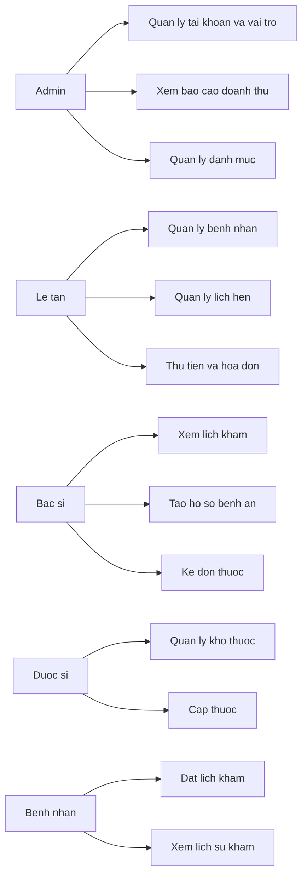
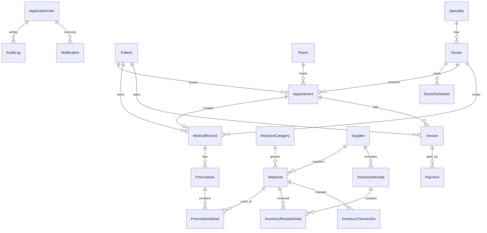

# PhongKham - Phan Tich Va Thiet Ke He Thong

## 1. Muc Tieu

He thong quan ly phong kham ho tro cac nghiep vu chinh: tiep nhan benh nhan, dat lich kham, quan ly bac si, phong kham, kho thuoc, ho so benh an, don thuoc, hoa don, bao cao doanh thu va phan quyen nguoi dung.

Ung dung duoc xay dung bang ASP.NET Core MVC, Entity Framework Core Code First, SQL Server va ASP.NET Core Identity. Kien truc muc tieu la MVC ket hop Repository va Service de tranh dat logic nghiep vu truc tiep trong Controller.

## 2. Vai Tro Va Quyen

| Vai tro | Quyen chinh |
| --- | --- |
| Admin | Quan ly toan bo he thong, tai khoan, vai tro, bao cao, danh muc |
| Bac si | Xem lich kham, xem benh nhan, tao benh an, chan doan, ke don |
| Le tan | Quan ly benh nhan, lich hen, tiep nhan, thu tien |
| Duoc si | Quan ly kho thuoc, nhap xuat kho, cap thuoc |
| Benh nhan | Dat lich, xem thong tin ca nhan, lich su kham va don thuoc |

Tat ca quyen backend phai duoc kiem tra bang `[Authorize]` va policy/role. Giao dien chi an hien menu theo quyen, khong thay the kiem tra o controller/service.

## 3. Luong Nghiep Vu Chinh

### 3.1 Dat lich va tiep nhan

1. Le tan hoac benh nhan tao lich hen.
2. Service kiem tra:
   - Khong dat trong qua khu.
   - Bac si khong trung lich.
   - Phong khong trung lich.
   - Lich nam trong gio lam viec cua bac si.
3. Le tan xac nhan lich.
4. Khi benh nhan den, lich chuyen sang trang thai da den/dang cho kham.

### 3.2 Kham benh va ke don

1. Bac si mo lich hen duoc phan cong.
2. Bac si tao ho so benh an tu lich hen da tiep nhan.
3. Bac si chan doan va tao don thuoc.
4. Service kiem tra thuoc con ton, chua het han, dang hoat dong va canh bao di ung neu co.

### 3.3 Cap thuoc va thanh toan

1. Duoc si xem don thuoc cho cap thuoc.
2. Khi cap thuoc, he thong dung transaction de:
   - Cap nhat trang thai don.
   - Tru ton kho.
   - Tao giao dich kho.
3. Le tan/ke toan lap hoa don va thanh toan.
4. Bao cao doanh thu chi tinh hoa don da thanh toan.

## 4. Use Case Tom Tat



## 5. ERD De Xuat



## 6. Cac Bang Chinh

| Bang | Vai tro |
| --- | --- |
| ApplicationUser | Tai khoan dang nhap Identity |
| Patient | Ho so benh nhan, soft delete |
| Doctor, Specialty, DoctorSchedule | Bac si, chuyen khoa, lich lam viec |
| Room | Phong kham/phong benh/kho |
| Appointment | Lich hen va trang thai tiep nhan |
| MedicalRecord | Ho so benh an |
| Medicine, MedicineCategory, Supplier | Danh muc va kho thuoc |
| InventoryReceipt, InventoryReceiptDetail, InventoryTransaction | Nhap xuat va lich su kho |
| Prescription, PrescriptionDetail | Don thuoc va chi tiet |
| Invoice, Payment | Hoa don va thanh toan |
| AuditLog, Notification | Nhat ky thao tac va thong bao |

## 7. Cau Truc Thu Muc Muc Tieu

```text
PhongKham/
  Controllers/
  Data/
  Models/
  Repositories/
  Services/
  ViewModels/
  Views/
  wwwroot/
docs/
scripts/
tests/
```

## 8. Ke Hoach Trien Khai Theo Giai Doan

1. Nen tang: Identity, DbContext, entity, seed role/user, repository/service, dashboard.
2. Module tiep nhan: Patient, Doctor, Room, Appointment voi validation trung lich.
3. Module kham benh: MedicalRecord, Prescription, PrescriptionDetail.
4. Module kho thuoc: Medicine, Supplier, nhap xuat kho, transaction cap thuoc.
5. Module tai chinh: Invoice, Payment, Chart.js report.
6. Bao mat va hoan thien: phan quyen tung role, audit log, trang loi, unit test.

## 9. Huong Dan Chay Hien Tai

1. Kiem tra SQL Server instance `.\\SQLEXPRESS03` dang chay.
2. Neu SQL Server loi TLS/SSPI, chay PowerShell bang Administrator:

```powershell
.\scripts\RepairSqlTls.ps1
.\scripts\EnableSqlMixedMode.ps1
```

3. Ung dung hien dung database `PhongKhamFullDb` va SQL Login Development:

```text
User Id=phongkham_app
Password=PhongKham@Dev123
```

Day la mat khau mau cho Development, can doi khi trien khai.

4. Connection string nam trong `PhongKham/appsettings.json`.
5. Chay:

```powershell
dotnet restore
dotnet build PhongKham\PhongKham.csproj
dotnet run --project PhongKham\PhongKham.csproj --launch-profile http
```

6. Mo `http://localhost:5217`.

Tai khoan seed Identity phai duoc doi mat khau khi trien khai that. Mat khau seed chi dung cho moi truong Development.
